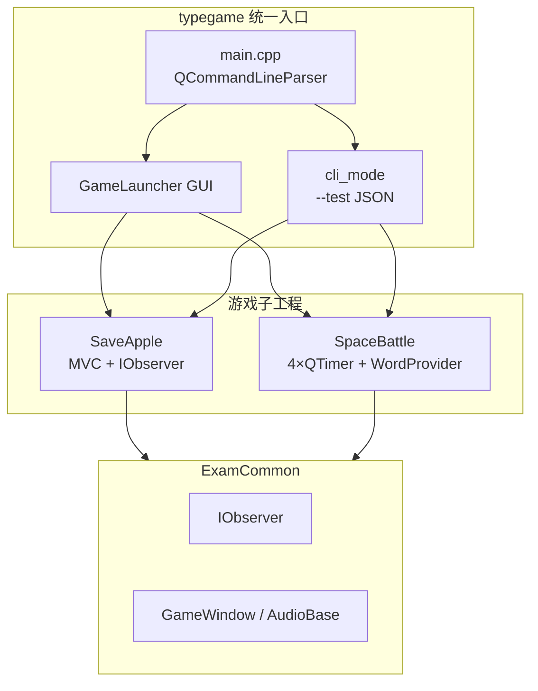
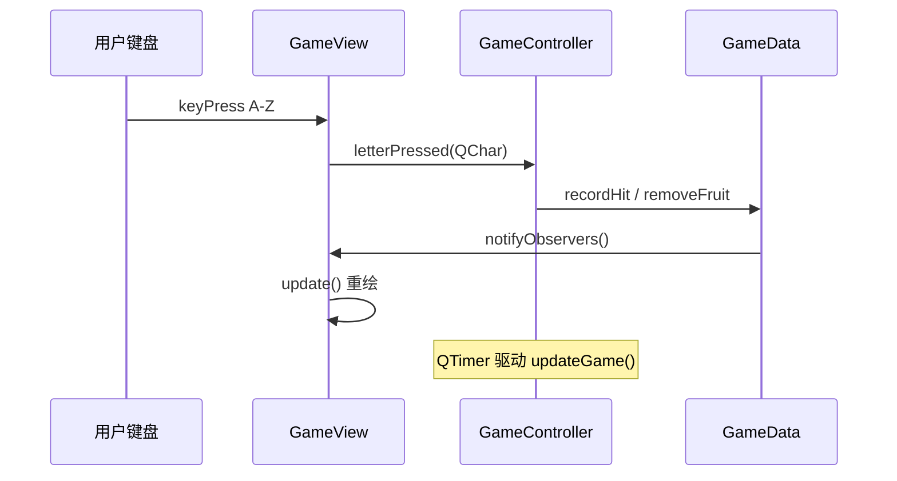
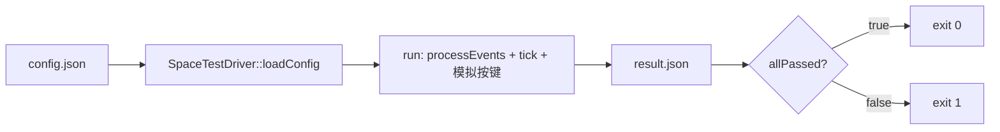
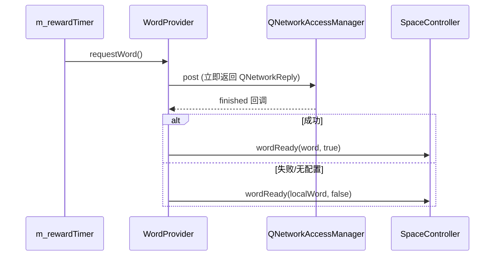

# TypeGame 作品集

> **作者**：邓子航  
> **周期**：2026.3 — 2026.5（金山办公 WPS 菁英计划训练营）  
> **技术栈**：C++17 · Qt5/6 · CMake · GoogleTest · HTTP（Chat Completions 兼容）  
> **代码路径**：`dengzihang/ClassExamProject`

---

## 一、项目概述（30 秒）

**TypeGame** 是基于 Qt 的英文打字游戏合集（拯救苹果 + 太空大战），以单一可执行文件 `typegame` 统一交付。区别于普通课程 demo，本项目强调 **工程化**：CMake 多模块、JSON 无头回归、MVC/观察者、多定时器实时循环、异步大模型词库与后台日志/埋点。

| 维度 | 说明 |
|------|------|
| 子工程 | `ExamCommon` / `SaveApple` / `SpaceBattle` / `typegame` |
| 单测 | GoogleTest **22** 用例（Space 13 + Apple 9） |
| CLI 验收 | `--test` JSON 输入/输出，`allPassed` → 进程退出码 0/1 |
| 产物 | `typegame.exe` + 测试可执行文件（见 `技术文档.md`） |

---

## 二、系统架构图

### 2.1 模块与依赖



### 2.2 MVC 数据流（SaveApple）



### 2.3 无头测试链路



### 2.4 大模型词库异步路径



---

## 三、核心代码片段（关键技术点）

> 以下片段均摘自本仓库源码，行号为撰写时参考；导出 PDF 时可保留语法高亮。

---

### 3.1 统一入口与 CLI 回归（`typegame/main.cpp` + `cli_mode.cpp`）

**作用**：一条命令完成「读 JSON → 驱动游戏 → 写结果 → 退出码验收」，支撑脚本化 CI/批测。

```cpp
// cli_mode.cpp — 太空大战无头测试出口
int runSpaceCliTest(const QString& inPath, const QString& outPath) {
    CliTestConfig cfg = SpaceTestDriver::loadConfig(inPath);
    QJsonObject result = SpaceTestDriver::run(cfg);
    if (!SpaceTestDriver::saveResult(outPath, result)) {
        std::fprintf(stderr, "typegame: failed to save result\n");
        return 6;
    }
    std::printf("typegame: test complete — %s\n",
                qPrintable(result["result"].toString()));
    return result["allPassed"].toBool() ? 0 : 1;  // 脚本可直接判断 $?
}
```

**说明**：
- `loadConfig` 解析 `letters`、`settings`、`testGameDuration`、`testConfig` 等字段。
- `run` 内部创建 Model/View/Controller，**不依赖人工点界面**。
- **`allPassed` → exit code** 是「可回归」的核心契约。

**命令示例**：

```bat
typegame.exe space --test --input config.json --output result.json
echo ExitCode=%ERRORLEVEL%
```

---

### 3.2 无头测试主循环（`SpaceTestDriver.cpp`）

**作用**：在 `QApplication` 事件循环中推进真实 `tick()`，并按策略注入按键。

```cpp
while (true) {
    qint64 now = QDateTime::currentMSecsSinceEpoch();
    if (now - startMs >= durationMs) break;
    if (model->state() != SpaceGameState::Playing) break;

    QApplication::processEvents();  // 让定时器/网络回调能执行
    ctrl->tick();                   // 推进一帧游戏逻辑

    if (now - lastInputMs >= 900) {
        lastInputMs = now;
        QChar toPress = (mode == "AllCorrect")
            ? pickCorrectLetter(model)
            : pickWrongLetter(model);
        ctrl->onLetterPressed(toPress);
        // ...
    }
}
```

**说明**：
- **`processEvents` + `tick`**：无 GUI 交互也能跑通 Controller 逻辑。
- 模式 `AllCorrect` / `WithErrors` / `AllWrong` 用于覆盖正例与误触路径。

---

### 3.3 多定时器拆分实时职责（`SpaceController.cpp`）

**作用**：tick（~60Hz）、刷怪、升难度、要奖励词 **周期不同**，拆成 4 个 `QTimer`，避免单循环里堆满 `if (到点了)`。

```cpp
// 构造：四路定时器绑定四个槽
connect(&m_tickTimer,    &QTimer::timeout, this, &SpaceController::tick);
connect(&m_spawnTimer,   &QTimer::timeout, this, &SpaceController::spawnEnemy);
connect(&m_upgradeTimer, &QTimer::timeout, this, &SpaceController::upgradeDifficulty);
connect(&m_rewardTimer,  &QTimer::timeout, this, &SpaceController::spawnRewardWord);

m_tickTimer.start(kTickMs);        // constexpr kTickMs = 16  ≈ 60 FPS
m_spawnTimer.start(kSpawnMsBase);  // 900ms，难度提升后会 start(更短间隔)
```

**主循环 `tick()`（变步长 dt + 实体清理）**：

```cpp
void SpaceController::tick() {
    const qint64 now = QDateTime::currentMSecsSinceEpoch();
    double dt = (m_lastMs != 0)
        ? qBound(0.001, (now - m_lastMs) / 1000.0, 0.05) : 0.016;
    m_lastMs = now;

    if (m_model->state() != SpaceGameState::Playing) {
        m_view->refreshUi(dt);
        return;
    }
    updateShip(dt);
    updateEnemies(dt);
    updateBullets(dt);
    updateReward(dt);
    // remove_if 清理死亡敌机/子弹；生命≤0 时 stop 其它定时器并 saveScore
    m_view->refreshUi(dt);
}
```

**说明**：
- **`dt` 钳制**：避免卡顿后单帧跳变过大。
- **Game Over 时 `stop` spawn/upgrade/reward**，tick 仍可刷新 UI。

---

### 3.4 MVC + 观察者刷新（`GameData.cpp`）

**作用**：Model 变更后统一通知 View，Controller 不必手动 `view->update()` 到处散落。

```cpp
void GameData::attach(IObserver* observer) {
    if (!m_observers.contains(observer))
        m_observers.push_back(observer);
}

void GameData::notifyObservers() {
    for (IObserver* observer : m_observers) {
        if (observer)
            observer->onModelChanged();
    }
}
```

**说明**：`GameView` 实现 `IObserver::onModelChanged()` 触发重绘，符合 **开闭原则**——加新观察者不必改 Model 内部逻辑。

---

### 3.5 异步日志 Worker（`AsyncLogger.cpp`）

**作用**：UI 线程只 **入队**，后台 `std::thread` **批量写文件**，避免同步 IO 卡顿。

```cpp
void AsyncLogger::log(const std::string& level, const std::string& message) {
    const std::string line = "[" + ts + "] [" + level + "] " + message;
    {
        std::lock_guard<std::mutex> lock(m_mutex);
        m_pendingLines.push_back(line);
    }
    m_cv.notify_one();  // 唤醒 worker
}

void AsyncLogger::workerLoop() {
    std::ofstream out(m_logFilePath, std::ios::app);
    while (true) {
        std::deque<std::string> localBatch;
        {
            std::unique_lock<std::mutex> lock(m_mutex);
            m_cv.wait(lock, [this]() { return m_stop || !m_pendingLines.empty(); });
            if (m_stop && m_pendingLines.empty()) break;
            localBatch.swap(m_pendingLines);  // 缩短持锁时间
        }
        for (const auto& line : localBatch)
            out << line << '\n';
        out.flush();
    }
}
```

**说明**：经典 **生产者-消费者**；析构时 `m_stop=true` + `notify` + `join` 保证优雅退出。

---

### 3.6 埋点后台聚合（`AnalyticsManager.cpp`）

**作用**：事件先入队，worker 侧聚合为 `unordered_map` 计数，再交给 `AsyncLogger` 输出快照。

```cpp
void AnalyticsManager::recordEvent(const std::string& eventName, int delta) {
    {
        std::lock_guard<std::mutex> lock(m_mutex);
        if (!m_sessionRunning) return;
        m_queue.push_back({eventName, delta});
    }
    m_cv.notify_one();
}

void AnalyticsManager::workerLoop() {
    while (true) {
        // wait → batch.swap(m_queue) → 累加 m_counter → 拼 analytics_tick 日志
        AsyncLogger::instance().info(oss.str());
    }
}
```

**说明**：与 3.5 相同并发模型；**会话级** `startSession` / `finishSession` 控制统计边界。

---

### 3.7 大模型异步拉词 + 降级（`WordProvider.cpp`）

**作用**：`post` **立即返回**；在 `finished` 槽里解析/重试/回退本地词库，不阻塞游戏主循环。

```cpp
QNetworkReply* reply = m_net->post(req, QJsonDocument(body).toJson(QJsonDocument::Compact));
QObject::connect(reply, &QNetworkReply::finished, this, [this, reply, ...]() {
    reply->deleteLater();
    if (reply->error() != QNetworkReply::NoError) {
        llmDiag("network", reply->errorString());
        emit wordReady(pickLocalWordAvoidingUsed(), false);
        return;
    }
    QString word = parseWordFromChatCompletionJson(raw);
    if (word.isEmpty() || shouldRejectSpaceWord(word, m_usedApiWords)) {
        if (m_wordRequestAttempt < 5) {
            ++m_wordRequestAttempt;
            requestOpenAiCompatible(apiUrl, apiKey, model);  // 有限重试
            return;
        }
        emit wordReady(pickLocalWordAvoidingUsed(), false);
        return;
    }
    emit wordReady(word, true);  // fromApi = true
});
```

**说明**：
- 接口形态为 **Chat Completions 兼容 HTTP**（`apiUrl`/`apiKey`/`model` 可配百炼等）。
- **无配置**时 `requestWord()` 直接本地 `emit`，零网络依赖。

---

## 四、测试报告（证明可测、可用）

### 4.1 GoogleTest 单元测试（22 用例）

| 模块 | 可执行文件 | 用例数 | 覆盖要点 |
|------|------------|--------|----------|
| SpaceBattle | `spacebattle_tests.exe` | **13** | `SpaceModel` 状态、设置、敌人/子弹结构 |
| SaveApple | `saveapple_nonui_tests.exe` | **9** | `Fruit`、`GameData` 边界与通关、`GameConfig` 资源路径 |

**SaveApple 示例用例（`test_gamedata.cpp`）**：

```cpp
TEST(GameDataTest, RecordHitMarksPassedWhenTargetReached) {
    GameData data;
    data.setTargetCount(5);
    for (int i = 0; i < 5; ++i)
        data.recordHit();
    EXPECT_TRUE(data.isPassed());
}
```

**运行方式**（见 `技术文档.md` §6.3）：

```bat
build_win.bat
build\bin\Release\spacebattle_tests.exe
build\bin\Release\saveapple_nonui_tests.exe
```

**预期输出（示意）**：

```text
[==========] Running 13 tests from 1 test suite.
[  PASSED  ] 13 tests.
```

> 导出 PDF 时：附一张终端 **全部 PASSED** 的截图即可。

---

### 4.2 CLI 集成测试（JSON 驱动）

**输入 `config.json`（Space 示例，字段可裁剪）**：

```json
{
  "letters": "ABCDEFGHIJKLMNOPQRSTUVWXYZ",
  "testGameDuration": 30,
  "settings": {
    "enemysNum": 5,
    "enemysSpeed": 3,
    "isPrize": true,
    "upgradeInterval": 120
  },
  "testConfig": {
    "correctRounds": 1,
    "errorRounds": 1,
    "allwrongRounds": 1,
    "errorFrequency": 5
  }
}
```

**输出 `result.json`（结构示意）**：

```json
{
  "allPassed": true,
  "gameName": "Space",
  "result": "passed",
  "rounds": [
    {
      "round": 1,
      "mode": "AllCorrect",
      "passed": true,
      "comparison": { "correctInputs": "12/12", "score": "12/12" }
    }
  ]
}
```

**验收命令**：

```bat
typegame.exe space --test --input config.json --output result.json
if %ERRORLEVEL%==0 (echo PASS) else (echo FAIL)
```

| 检查项 | 通过标准 |
|--------|----------|
| 退出码 | `allPassed==true` → `0` |
| 结果文件 | `result.json` 可解析且含 `rounds` |
| 控制台 | 打印 `test complete — passed` |

---

### 4.3 单测 vs CLI 分工

| 类型 | 目的 | 速度 | 覆盖 |
|------|------|------|------|
| **GoogleTest** | 纯数据/规则回归 | 快 | Model、Config、Fruit |
| **CLI `--test`** | 真实引擎 + 按键模拟 | 较慢 | Controller 集成链路 |

---

## 五、运行演示与截图（PDF 插图位）

> 将下列截图放入 `ClassExamProject/assets/`，导出 PDF 时嵌入对应位置。  
> 若暂无图，可先运行游戏后按文件名补拍。

| 序号 | 建议文件名 | 内容 | 证明什么 |
|------|------------|------|----------|
| 1 | `01_launcher.png` | `typegame` 无参启动 — 双卡片选关界面 | 统一入口、可演示 |
| 2 | `02_saveapple_play.png` | 拯救苹果游戏中（水果下落 + HUD） | SaveApple 可玩 |
| 3 | `03_spacebattle_play.png` | 太空大战游戏中（敌机 + 字母） | SpaceBattle 实时循环 |
| 4 | `04_space_reward_word.png` | 奖励模式英文词掠过屏幕 | 大模型/本地词库生效 |
| 5 | `05_cli_test_terminal.png` | 执行 `--test` 后终端输出 + `echo %ERRORLEVEL%` | 无头回归 |
| 6 | `06_result_json.png` | 用编辑器打开 `result.json` 高亮 `allPassed` | 结构化验收 |
| 7 | `07_gtest_pass.png` | `spacebattle_tests.exe` 全部 PASSED | 单元测试 |
| 8 | `08_log_snippet.png` | `logs/game.log` 中 `analytics_tick` / `WordProvider[LLM]` 行 | 异步日志与诊断 |

**插图占位（本地有图后替换路径）**：

```markdown


```

---

## 六、构建与快速验证

```bat
cd ClassExamProject
build_win.bat
build\bin\Release\typegame.exe
build\bin\Release\typegame.exe space --test --input config.json --output result.json
```

依赖：CMake ≥ 3.16、Qt5 或 Qt6（Widgets/Multimedia/Network）、MSVC 或等价 C++17 工具链。详见 `README.md`、`技术文档.md`。

---

## 七、亮点对照（面试官 1 分钟版）

| 亮点 | 代码锚点 |
|------|----------|
| JSON 无头回归 | `cli_mode.cpp`、`SpaceTestDriver.cpp` |
| 多定时器实时循环 | `SpaceController.cpp` 构造 + `tick()` |
| MVC + 观察者 | `GameData::notifyObservers` |
| 异步日志 worker | `AsyncLogger::workerLoop` |
| 埋点队列聚合 | `AnalyticsManager::workerLoop` |
| 大模型异步 + 降级 | `WordProvider::requestOpenAiCompatible` |

---

## 八、简历粘贴（三条）

- CMake 多模块 + `typegame` 统一入口；**`--test` JSON 无头回归**（`allPassed`→退出码）+ **GoogleTest 22 用例**。  
- SaveApple：**MVC + `IObserver`**；SpaceBattle：**四路 `QTimer`** + 变步长 `tick` 主循环。  
- **Chat Completions 兼容 HTTP** 异步生词（配置/重试/本地回退/诊断）；**`AsyncLogger` + `AnalyticsManager`** 后台 worker。

---

## 九、仓库与保密说明

- **公开投递**：可仅附本 `作品集.md` 导出 PDF + 截图，不公开源码。  
- **愿展示源码**：GitHub **Private** 仓库，面试前为面试官开 **Collaborator** 只读权限即可。  
- **更多细节**：`技术文档.md`（完整目录、测试逐条表、迭代记录见 `SpaceBattle/迭代记录.md`）。

---

*文档与 `dengzihang/ClassExamProject` 源码同步维护。*
